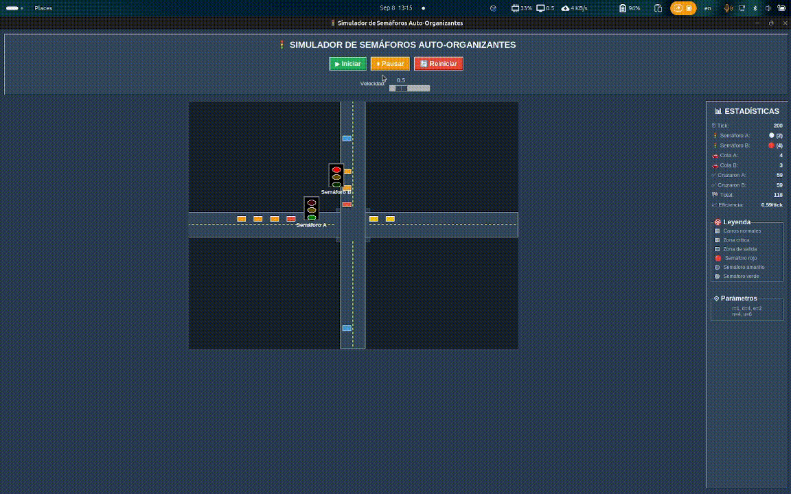

# 🟢 **Semáforos Auto-Organizados**

 

Este proyecto implementa una **simulación de semáforos auto-organizados** en Python, basada en reglas adaptativas para gestionar el flujo de tráfico de manera eficiente.

A diferencia de los semáforos tradicionales con ciclos fijos, los **semáforos auto-organizados** cambian su estado en función de la presencia y cantidad de vehículos que se aproximan a la intersección, siguiendo principios de sistemas complejos y autoorganización.



# Objetivo del Proyecto

El objetivo de este proyecto es simular y comparar dos sistemas de control de tráfico:

    Semáforos Autoorganizados: Un modelo inteligente donde los semáforos ajustan sus ciclos de manera dinámica para optimizar el flujo vehicular.

    Semáforos Estáticos: Un modelo tradicional en el que los semáforos cambian de estado (verde, rojo) a intervalos de tiempo fijos y preestablecidos.

El proyecto busca demostrar la eficiencia de los semáforos autoorganizados frente a los estáticos, mostrando cómo la auto-organización puede reducir la congestión y mejorar el flujo de vehículos en una intersección.

## 1. **Imágenes ilustrativas del problema:**


*Imagen de referencia de como se distribuyen las distancias y las direcciones de las carreteras en la simulación de los semáforos autoorganizados.*


*Imagen descriptiva de las reglas para simular un semáforo autoorganizado.*

## 2. Preguntas y Análisis Del Proyecto.

Un semáforo **autoorganizado** significa que **no sigue un ciclo fijo** (como 30s en rojo, 10s en verde, etc.), sino que **se adapta dinámicamente** a la cantidad de autos que se acercan.

- **¿Cuántos semáforos se simularan?**
    
    En el proyecto se planea empezar simulando 2 semáforos inicialmente, para poder comprobar el funcionamiento correcto de la simulación, luego se evaluara si se aumentara el numero de semáforos a 4.
    
- **¿Cuáles son las secuencias de colores (rojo, amarillo, verde) para cada luz?**
    
    Se utilizara la secuencia tradicional rojo, amarillo, verde para la simulación.
    
- **¿Cómo se comunicarán las luces entre sí para autoorganizarse?**
    - [x]  Cada semáforo cuenta autos a una distancia `d` de un semáforo rojo con un contador `c`.
    - [x]  Si el número de autos esperando `c` es ≥ umbral `n` → se solicita el verde.
    - [x]  El contador `c` se reiniciara a 0 cuando el semáforo cambia de color.
    - [x]  Cada que se cambie de color en el semáforo, se asignara el color amarillo como intermediario durante un tiempo 1 tic para evitar colisiones.
    - [x]  El semáforo que está en verde debe respetar un **tiempo `u` mínimo** antes de ceder.
    - [x]  Si 1 vehículo a distancia `r` esta detrás de un semáforo verde, esperara a que el vehículo cruce para cambiar a rojo.
    - [x]  Si no hay vehículos a distancia `d` de un semáforo en verde y además hay un vehículo a la distancia `d` de un semáforo rojo, cambia ambos semáforos.
    - [x]  Si hay un vehículo a una distancia `e` de un semáforo en verde, cambia a rojo.
    - [x]  Si hay varios vehículos detenidos a una distancia `e`, cambiara ambos semáforos a rojo y cambiara a verde el semáforo del primer carril que se descongestione.


### Escenarios encontrados durante creación del diagrama de flujo:


<blockquote>
  <p>🚦 <strong>Escenario 1: ambos semáforos en rojo → ambos piden verde → colisión</strong></p>
  <p>Este escenario es <strong>real</strong> y suele llamarse <em>deadlock con colisión</em>.</p>
  <p>Si ambos superan el umbral <em>n</em> al mismo tiempo, cambiarían a verde simultáneamente y chocarían.</p>
</blockquote>

### Solución a escenarios encontrados

<blockquote>
  <ul>
    <li>
       <strong>Turno alternado (round-robin)</strong>
      <ul>
        <li>Guardas una variable global prioridad.</li>
        <li>Si ambos solicitan verde a la vez → se asigna el verde al carril que NO tuvo el verde la última vez.</li>
        <li>Esto asegura equidad y evita bloqueos prolongados.</li>
      </ul>
    </li>  
  </ul>
  <strong>Esperar la primera solicitud</strong>
  <ul>
    <li>Ambos empiezan en rojo y <code>prioridad = None.</code></li>
    <li>Cuando los dos pidan verde al mismo tiempo por primera vez, decides aleatoriamente quién empieza y actualizas <code>prioridad</code>.</li>
  </ul>
</blockquote>

- **¿Todos los vehículos se moverán a la misma velocidad?**
    - Si se moverán a la misma velocidad inicialmente (1 bloque/tic).
    - Luego del resultado inicial se evaluara si es posible aumentar la velocidad de ciertos vehículos.
- **¿Cuántos vías se añadirán?**
    - La respuesta depende del numero de semáforos a implementar, inicialmente serán 2, por lo que tendremos solo 2 vías.
    - A medida que se avance con el código, se evaluara si es posible agregar mas vías.

### **En el proyecto definiremos las distancias de las carreteras como bloques en listas.**
<blockquote>
  <ol>
    <li><code>r</code> → Distancia mínima antes del semáforo y el auto, definido como un solo bloque.</li>
    <li><code>d</code> → Distancia máxima para la detección de autos antes de un semáforo, definida por 6 bloques.</li>
    <li><code>e</code> → Distancia corta mas allá de la intersección definida por 3 bloques.</li>
    <li><code>n</code> → Umbral de cantidad de vehículos a una distancia d detrás de un semáforo en rojo (3 vehículos).</li>
    <li><code>c</code> → Contador de vehículos a una distancia d detrás de un semáforo en rojo.</li>
    <li><code>u</code> → Tiempo mínimo de espera de un semáforo en verde (4 tics).</li>
  </ol>
</blockquote>


*Imagen ilustrativa de como se representaran las carreteras, tomando las distancias como bloques en los arreglos.*

# 3. Comparación Semáforos AutoOrganizados vs Semáforos Estáticos

La comparación entre semáforos autoorganizados y estáticos muestra que no existe un sistema universalmente mejor, sino que la eficiencia depende directamente del escenario de tráfico. Los **semaforos estáticos** presentan ventajas cuando el flujo vehicular es **constante y balanceado**, ya que eliminan el tiempo de decisión y garantizan ciclos predecibles que se aprovechan de forma uniforme en todas las direcciones. En estas condiciones, el “overhead” de cálculo que requieren los autoorganizados puede convertirse en una desventaja.

Por otro lado, los **semaforos autoorganizados** destacan en situaciones de **tráfico irregular, asimétrico o muy ligero**, ya que pueden adaptarse dinámicamente y evitar el desperdicio de tiempo otorgando luz verde a carriles vacíos. Esto los convierte en una solución más eficiente frente a escenarios impredecibles o con picos de congestión, donde los semáforos fijos tienden a generar esperas innecesarias.  

## **Por qué los Semáforos Estáticos Pueden Ser Más Rápidos:**

### **1. Overhead de Decisión**
- **Estáticos**: Cambio automático sin cálculos → 0 tiempo perdido
- **Autoorganizados**: Tiempo gastado en contar, evaluar reglas, decidir
- **Resultado**: Los estáticos no "dudan", simplemente cambian

### **2. Predictibilidad vs Adaptabilidad**
- **Estáticos**: Tiempo fijo garantizado para cada dirección
- **Autoorganizados**: Pueden "desperdiciar" verde esperando que lleguen más autos
- **Ventaja estática**: Utilización garantizada del tiempo verde

### **3. Escenarios donde los Estáticos Ganan:**

1. **Tráfico Regular/Balanceado:**
   - Si ambas direcciones tienen flujo constante y similar
   - Los ciclos fijos aprovechan mejor el tiempo total
   - No hay "tiempo perdido" esperando decisiones

2. **Densidad de Tráfico Media:**
   - Los autoorganizados brillan en extremos (muy poco o mucho tráfico)
   - En densidad media, los estáticos son más eficientes

### **Escenarios donde Autoorganizados DEBERÍAN ganar:**

1. **Tráfico Muy Asimétrico**
   - Una dirección con 10 autos, otra con 1 auto
   - Los estáticos desperdiciarían tiempo dando verde a la dirección vacía

2. **Picos de Tráfico Irregulares** 
   - Tráfico que llega en ráfagas impredecibles
   - Los autoorganizados se adaptan, los estáticos no

3. **Tráfico Muy Ligero**
   - Pocos autos en ambas direcciones
   - Los autoorganizados dan verde solo cuando es necesario

##  **Posibles Problemas en tu Simulación:**

### **1. Parámetros Mal Calibrados**
```python
# Tal vez demasiado conservadores:
u = 4  # Puede ser muy corto y genera muchos cambios
n = 3  # puede ser muy sensible, cambia por pocos autos
```

### **2. Lógica de Reglas Puede Ser Ineficiente**
- ¿Los autoorganizados están "dudando" demasiado?
- ¿Hay tiempo perdido en evaluaciones?
- ¿Se están aplicando reglas contradictorias?


##  **Pruebas Realizadas:**

### **Test 3: Tráfico Ligero**
```python
# Muy pocos autos (5-10% probabilidad)
# Los autoorganizados deberían dar verde solo cuando es necesario, por lo tanto, tienen un mejor desempeño 
```

En conclusión, los semáforos estáticos pueden resultar más rápidos en condiciones de tráfico estable y balanceado, mientras que los autoorganizados ofrecen mejoras significativas cuando las condiciones cambian de manera dinámica. Por ello, el valor de cada sistema no radica en la velocidad aislada de los ciclos, sino en su capacidad de adaptarse (o no) al contexto real del flujo vehicular.

# 4. Codigo base de los Semaforos AutoOrganizados

A continuación se encuentra el link que contiene los borradores o codigos iniciales utilizados para elaborar el algoritmo.

[Ver simulación en Google Colab](https://colab.research.google.com/drive/1YNyg5TVh7IJDuTIjBXVnflSGOtVcmdpV?usp=sharing)

